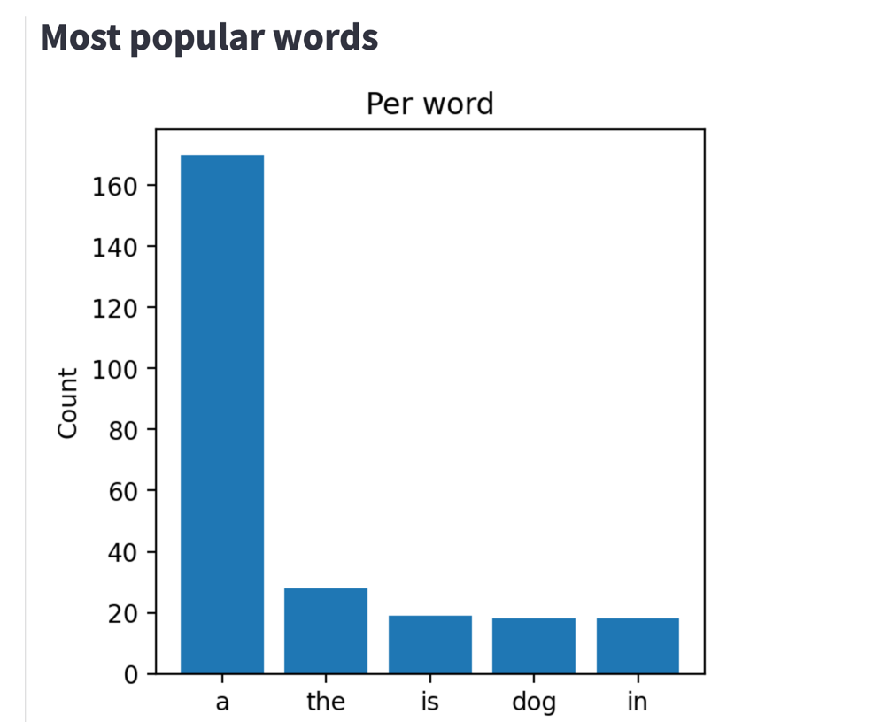
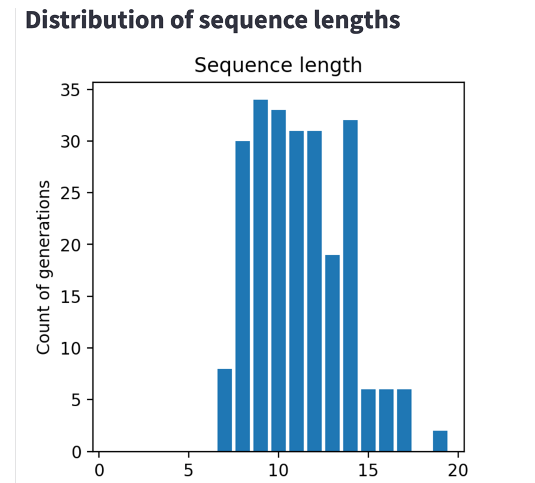

# Image Captioning repo

## Init repo

```bash
chmod +x ./init.sh
./init.sh
```
The best checkpoint will be in `data/checkpoints/best` folder.


## To run

Run the producer
```bash
source ./venv/bin/activate
export PATH=$PATH:~/.docker/bin
export PYTHONPATH=${PYTHONPATH}:.

docker compose up -d
python src/data_producer.py
```

Run the inference
```bash
source ./venv/bin/activate
export PATH=$PATH:~/.docker/bin
export PYTHONPATH=${PYTHONPATH}:.

docker compose up -d
python src/data_inference.py
```


Run the visualizer
```bash
source ./venv/bin/activate
export PATH=$PATH:~/.docker/bin
export PYTHONPATH=${PYTHONPATH}:.

docker compose up -d
python -m streamlit run src/visualize.py
```


